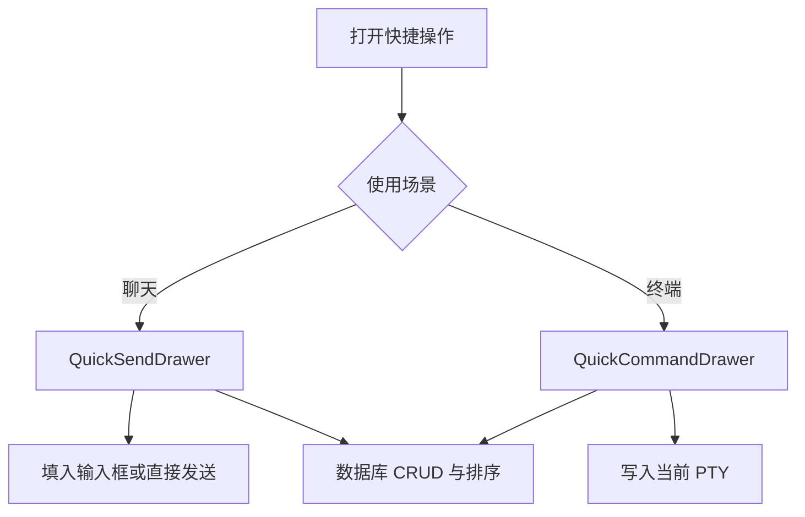

# 快捷操作

快捷操作降低移动端重复输入成本。聊天快捷发送保存常用 Prompt，终端快捷命令保存常用 shell 指令；两者共享“一键执行、编辑、排序”的交互模型，但执行目标和风险边界不同。

## 流程图

### 快捷项的创建与执行

聊天快捷项可以直接发送，也可以通过长按先填入输入框继续编辑。终端快捷命令始终作用于当前活动终端，避免误发到后台标签页。

## 功能与设计要点

### 功能清单

- **聊天快捷发送**：保存常用 Prompt，一键发送以减少移动端输入；长按可渐进填入输入框，适合先套模板再补参数
- **终端快捷命令**：保存常用 shell 指令并发送到当前 PTY，用于重复执行构建、测试或运维命令
- **编辑与删除**：快捷项支持新增、修改、删除，用户可以维护个人工作流而不是依赖内置固定列表
- **拖动排序**：顺序持久化到数据库，高频操作可以放在最容易触达的位置

### 设计要点

- **聊天与终端分库存储**：Prompt 和 shell 命令的执行语义、风险和展示需求不同，不能混为一个列表
- **终端命令不自动选择会话**：只写入用户当前可见的活动 PTY，降低误操作风险
- **长按用于编辑意图**：聊天短按代表立即执行，长按代表填充后修改，适配移动端有限的控件空间
- **排序由服务端持久化**：多个客户端重新加载后保持一致顺序
