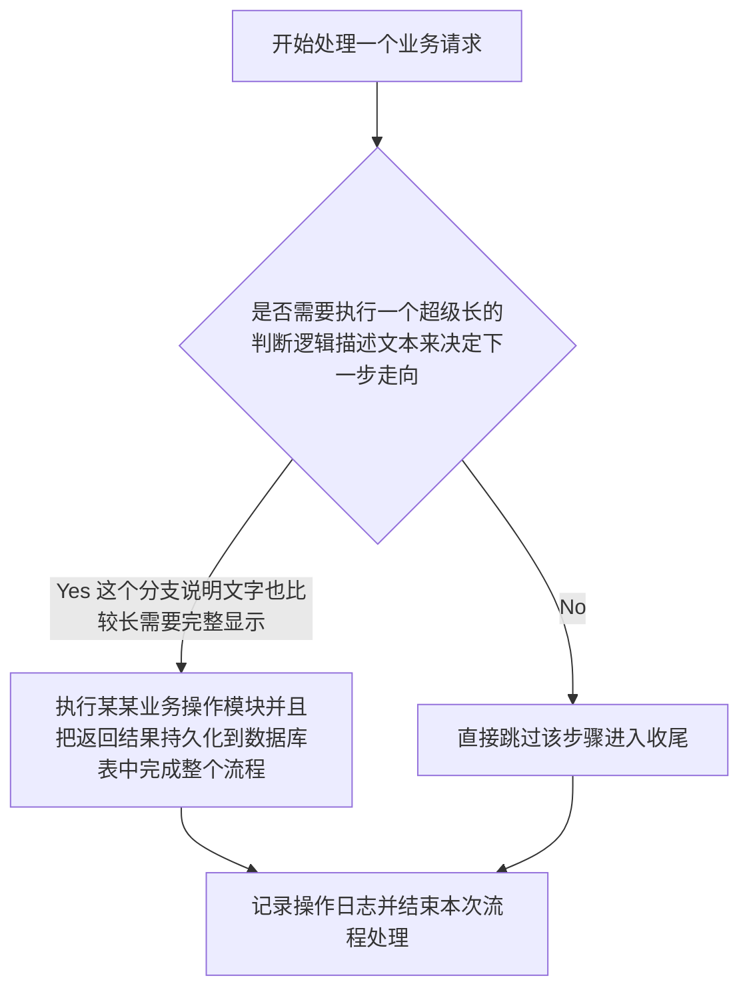
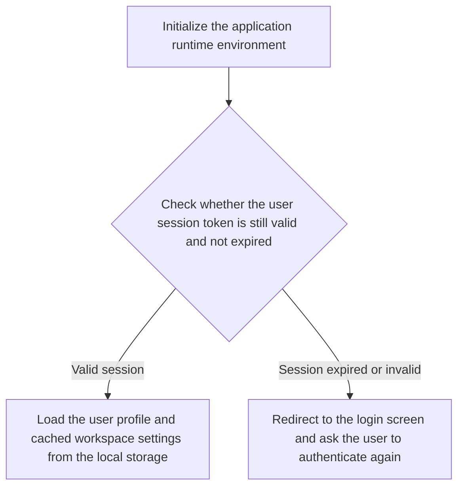
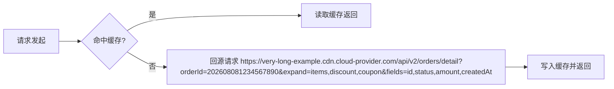
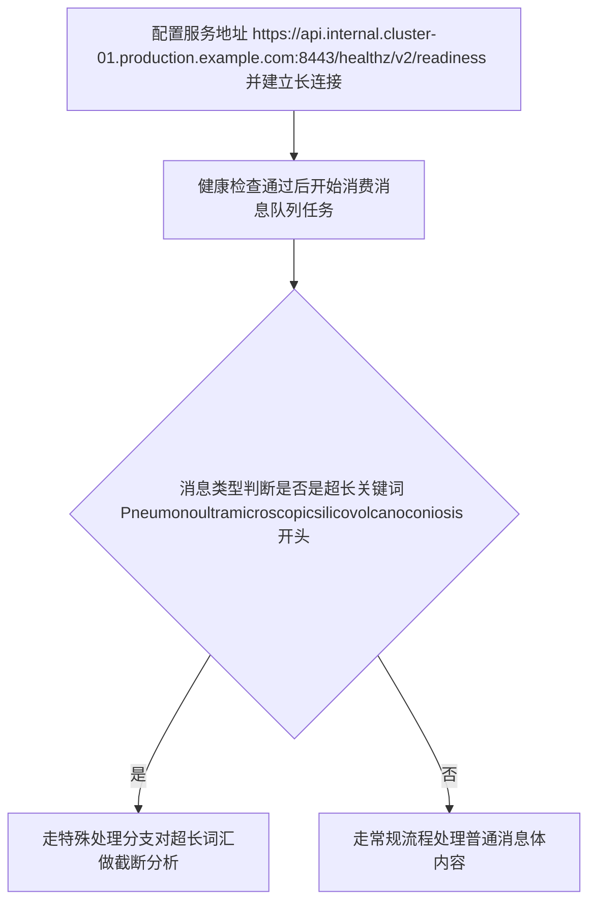
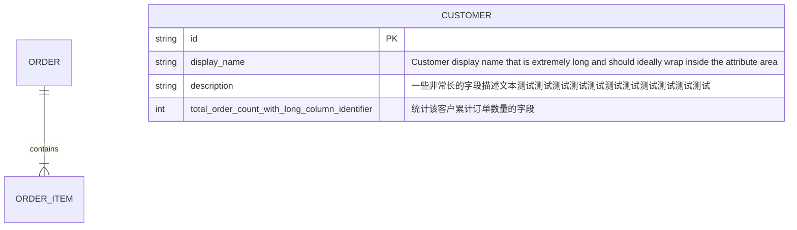
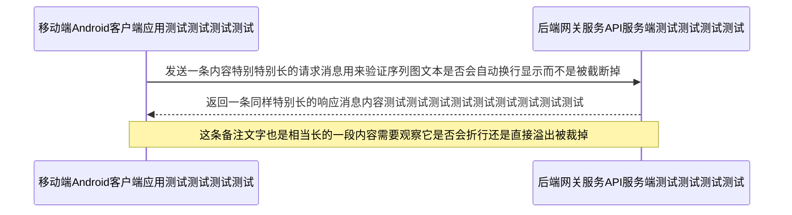
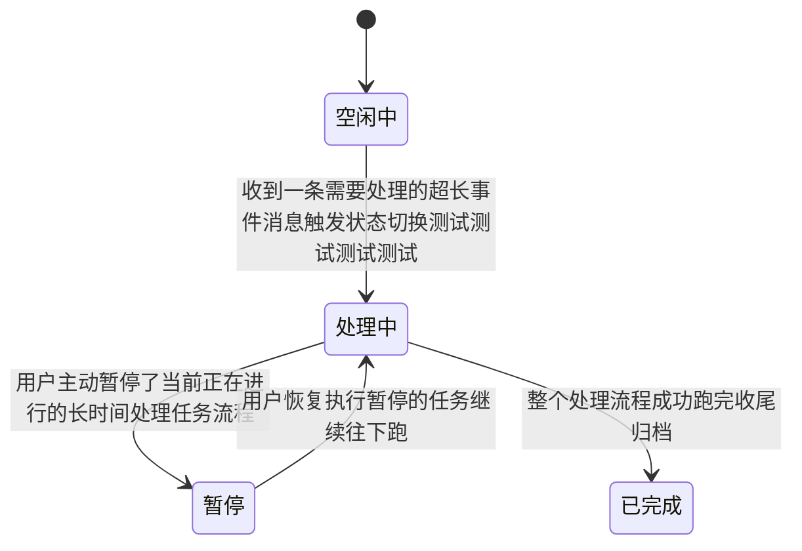
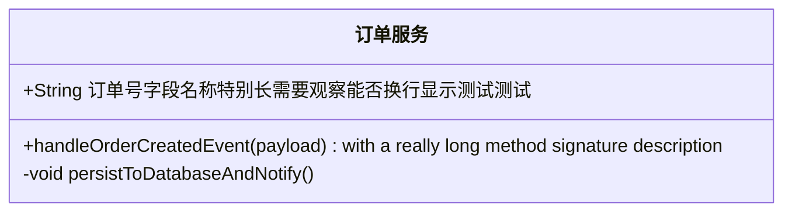

# Mermaid 长文本渲染测试

本文档包含多种带**长文本**的 Mermaid 图，用于验证节点文本的自动换行与截断问题。

---

## 1. 长中文句子（应自动按字符换行）

---

## 2. 长英文句子带空格（应按词换行）

---

## 3. 无空格长串 - 长 URL（典型不可断点场景）

---

## 4. 长 URL / 超长单词混合长句

---

## 5. ER 图超长属性与注释

---

## 6. 时序图超长参与者与消息

---

## 7. 状态图 / 类图长标签

